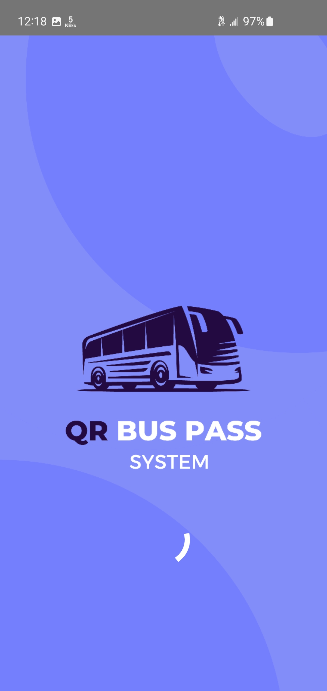
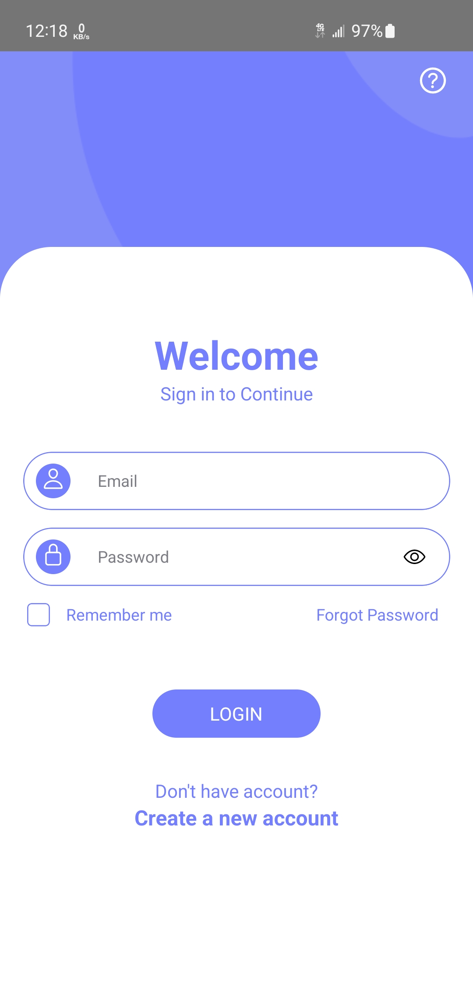
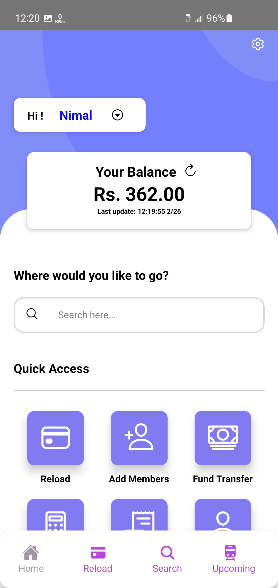
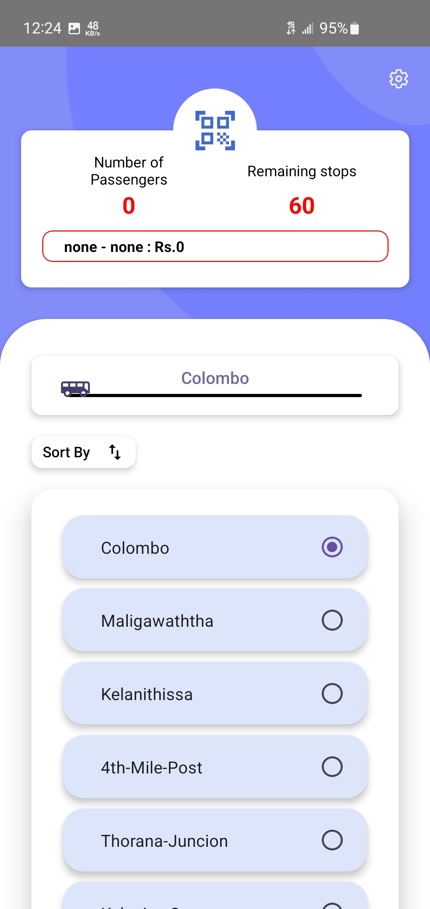
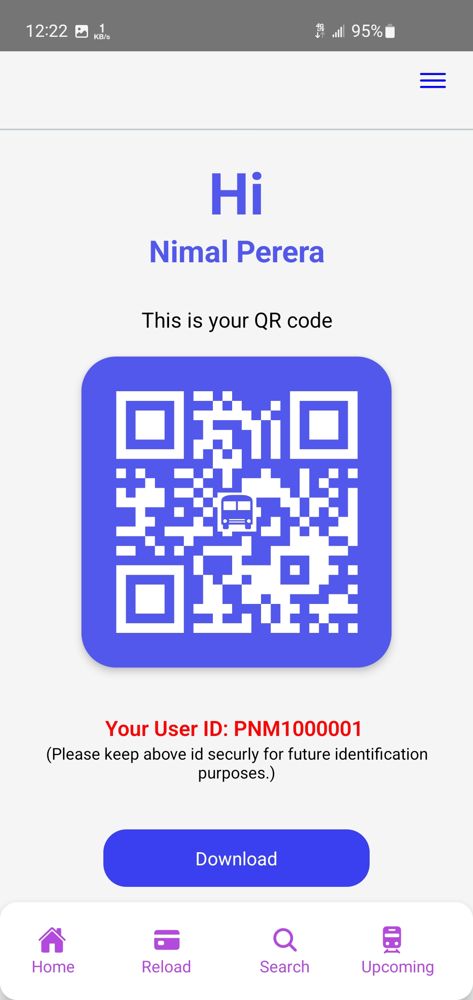
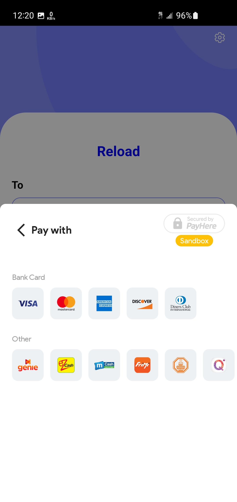
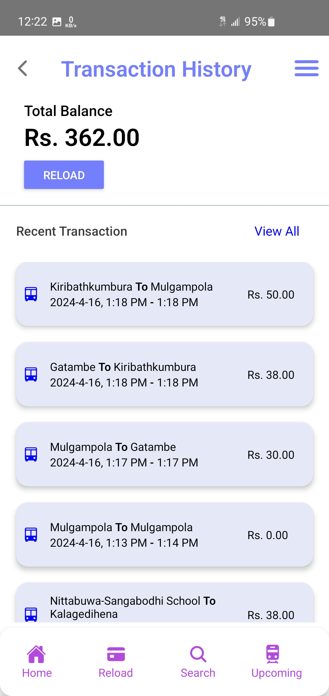
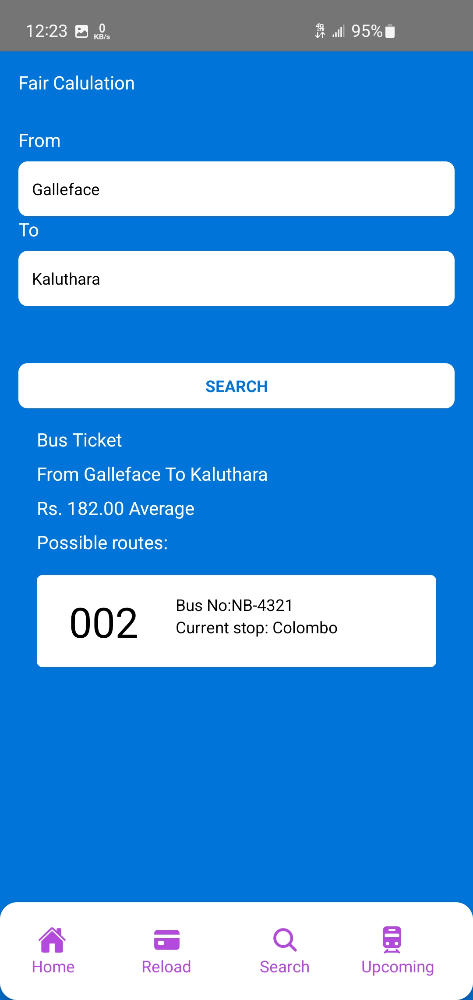

# QR-Based Bus Pass System🚌

## Overview
The inefficiencies of traditional paper-based bus pass systems have led to delays, increased operational costs, and environmental concerns. Additionally, in Sri Lanka's traditional system, some bus conductors often do not provide the correct balance or may overcharge passengers. This project proposes a simulated QR code-based bus pass system to enhance efficiency, reduce costs, and promote sustainability while ensuring accurate fare transactions. By leveraging digital technology, this system provides a seamless and user-friendly experience for passengers while streamlining public transportation processes.

## Features
- **Passenger Registration**: Users can sign up and create accounts within the app.
- **QR Code Generation**: A unique QR code is generated for each bus pass, allowing quick and easy boarding.
- **Credit Balance Management**: Users can check and top up their credit balance.
- **Fare Calculation**: The app calculates fares based on selected entry and exit points, ensuring accurate pricing and eliminating overcharges.
- **Secure Payment Integration**: Users can add credit via PayHere using various payment methods.
- **Real-Time Updates**: Instant data synchronization for a seamless user experience.

## Technology Stack
### 1. Mobile Application
- Developed using **React Native** for cross-platform compatibility (Android and iOS).
- Provides an intuitive and responsive UI/UX.

### 2. Backend Database
- Uses **Firebase** for real-time data storage and synchronization.
- Manages user data, QR code generation, and fare calculations efficiently.

### 3. Payment Gateway Integration
- Integrated with **PayHere** to enable secure and seamless credit top-ups.
- Supports multiple payment methods, including credit cards and mobile payments.

## How It Works
1. **User Registration**: Passengers create an account in the mobile app.
2. **Bus Pass Generation**: A unique QR code is assigned to the user.
3. **Credit Top-Up**: Users add funds to their balance via PayHere.
4. **Boarding Process**: Passengers scan their QR code when entering the bus.
5. **Fare Calculation**: The system deducts the fare based on the entry and exit points, ensuring transparency and accuracy.
6. **Real-Time Updates**: All transactions and balance updates reflect instantly in Firebase.

## Benefits
- **Efficiency**: Reduces boarding time and delays.
- **Cost-Effective**: Minimizes expenses associated with printing and distributing paper passes.
- **Accurate Fare Handling**: Eliminates overcharging and ensures passengers receive correct fare calculations.
- **Environmentally Friendly**: Promotes sustainability by eliminating paper waste.
- **User Convenience**: Provides an easy-to-use digital solution for fare management.

## Screenshots
- **Splash Screen**
  
  
- **Login Screen**
  
  
- **Home Screen**
  
  
- **QR Code Generation**
  
- **Payment Interface**
  
- **Transaction History**
  
- **Fair Calculation**
  

## Future Enhancements
- NFC-based tap-and-go functionality
- Offline mode for QR code scanning
- AI-driven route recommendations

## License
This project is licensed under the MIT License.

## Contributors
- Samarakoon S.(Me)
- SILVA A.D.K
• KAVINDI A.L.S.J 
• MANOHARI G.R.S.H 
• LAKSHAN K.A.S 
• SHAKITHTHIYAN P 

## Contact
For any inquiries or support, please contact [ssandiru@gmail.com].

